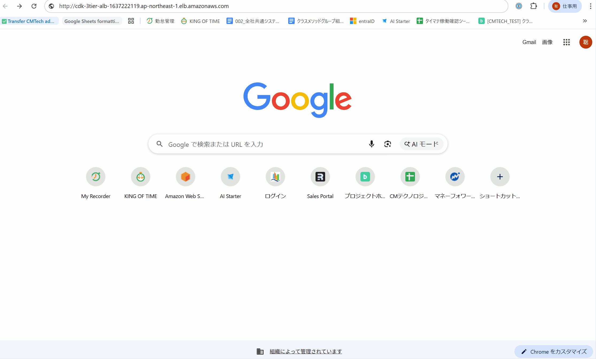
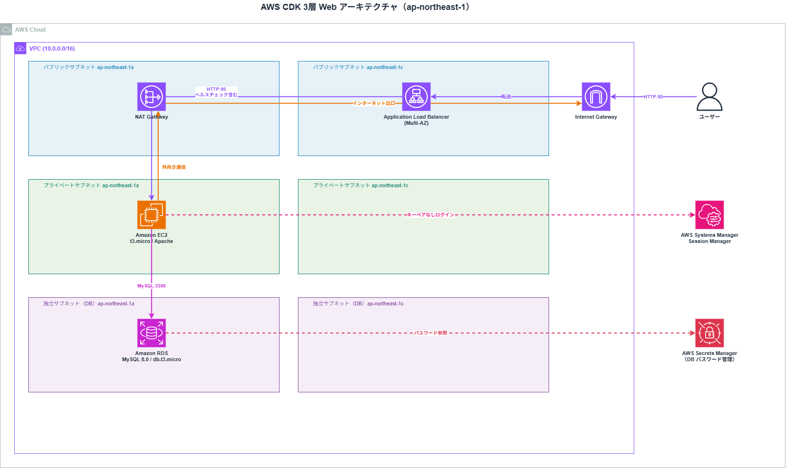
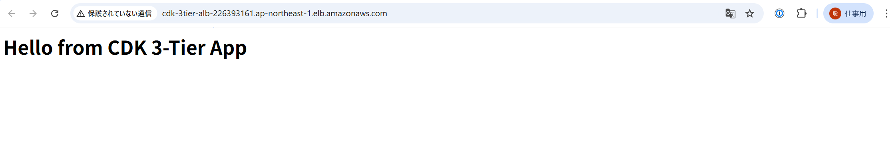
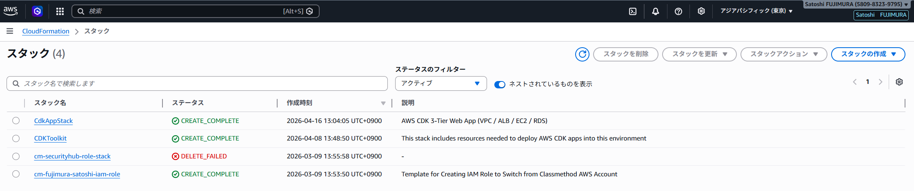
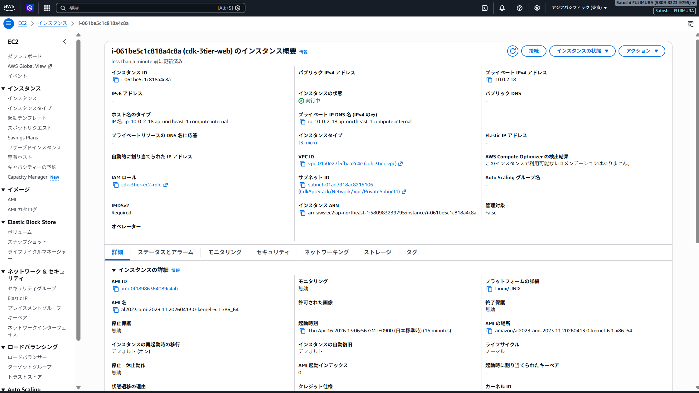
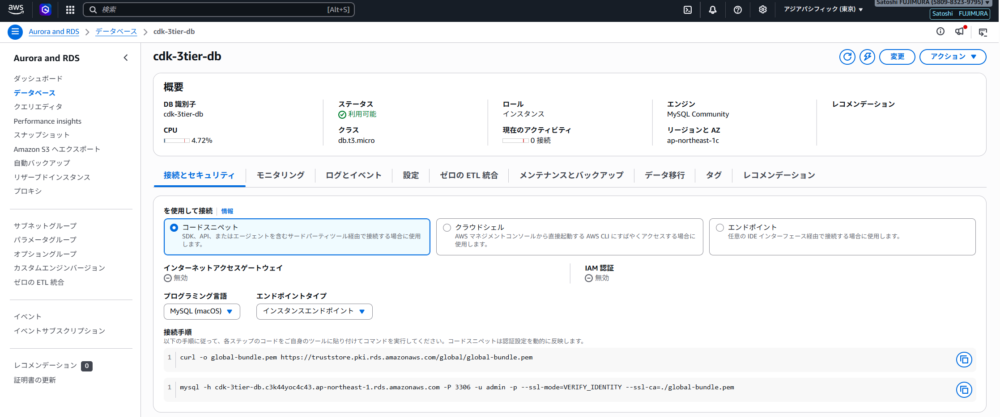

# aws-cdk-3tier-app


AWS CDK（TypeScript）で VPC / ALB / EC2 / RDS の **3層 Web アーキテクチャ**を実装したポートフォリオ。
Terraform 版（[terraform-3tier-webapp](https://github.com/satoshif1977/terraform-3tier-webapp)）の CDK 移植版として、IaC ツールの比較・学習を目的に構築。

---

## デモ



---

## アーキテクチャ



| レイヤー | コンポーネント | 内容 |
|---|---|---|
| **フロントエンド層** | ALB | Internet-facing / HTTP:80 / Multi-AZ（1a・1c） |
| **アプリ層** | EC2 (t3.micro) | Amazon Linux 2023 / Apache / Private Subnet |
| **データ層** | RDS MySQL 8.0 (t3.micro) | Isolated Subnet / Secrets Manager 認証 |
| **ネットワーク** | VPC (10.0.0.0/16) | Public / Private / Isolated × 2AZ / NAT GW × 1 |
| **監視層** | CloudWatch | Alarms × 5 + Dashboard |

---

## CDK Construct 構成

Terraform の `modules/` に相当する **CDK Construct** として各レイヤーを分割。

```
lib/
├── constructs/
│   ├── vpc-construct.ts          # VPC・3層サブネット・NAT Gateway
│   ├── alb-construct.ts          # ALB・セキュリティグループ・リスナー
│   ├── ec2-construct.ts          # EC2・IAM ロール・UserData（Apache）
│   ├── rds-construct.ts          # RDS MySQL・セキュリティグループ・Secrets Manager
│   └── monitoring-construct.ts   # CloudWatch Alarms・Dashboard
└── app-stack.ts                  # 各 Construct を統合（Terraform の main.tf 相当）
```

| Terraform | CDK |
|---|---|
| `modules/vpc/` | `lib/constructs/vpc-construct.ts` |
| `modules/alb/` | `lib/constructs/alb-construct.ts` |
| `modules/ec2/` | `lib/constructs/ec2-construct.ts` |
| `modules/rds/` | `lib/constructs/rds-construct.ts` |
| ※ Terraform 版は別リポジトリ参照 | `lib/constructs/monitoring-construct.ts` |
| `environments/dev/main.tf` | `lib/app-stack.ts` |

---

## セキュリティ設計

| 項目 | 設定 |
|---|---|
| EC2 へのアクセス | ALB セキュリティグループからの HTTP:80 のみ許可（直接公開なし） |
| RDS へのアクセス | EC2 セキュリティグループからの MySQL:3306 のみ許可 |
| EC2 ログイン | キーペアなし・SSM Session Manager 経由（IAM 認証） |
| DB パスワード | Secrets Manager で自動生成・管理 |
| ストレージ暗号化 | RDS 暗号化有効 |

---

## 監視設計（CloudWatch）

`monitoring-construct.ts` で 3 層すべてを監視。アラームは CloudWatch ダッシュボードで一元管理。

| アラーム名 | 対象 | 閾値 | 説明 |
|---|---|---|---|
| `cdk-3tier-alb-5xx-rate` | ALB | エラー率 5% | サーバーエラーの急増を検知 |
| `cdk-3tier-alb-unhealthy-hosts` | ALB ターゲット | 1台以上 | EC2 のヘルスチェック失敗を即検知 |
| `cdk-3tier-ec2-cpu-high` | EC2 | CPU 80% | 高負荷状態を検知 |
| `cdk-3tier-rds-cpu-high` | RDS | CPU 80% | DB 高負荷状態を検知 |
| `cdk-3tier-rds-free-storage-low` | RDS | 空き 2GB | ストレージ枯渇を事前検知 |

---

## 動作確認スクリーンショット

| # | 内容 | スクリーンショット |
|---|---|---|
| 1 | ALB DNS でブラウザアクセス → Hello from CDK 3-Tier App |  |
| 2 | CloudFormation → CdkAppStack: CREATE_COMPLETE |  |
| 3 | EC2 インスタンス詳細（プライベートサブネット配置） |  |
| 4 | RDS インスタンス詳細（cdk-3tier-db / MySQL 8.0） |  |

---

## 前提条件

```bash
node --version   # v18 以上
cdk --version    # 2.x 以上
aws configure    # 認証情報設定済み
```

---

## デプロイ手順

```bash
# 1. 依存パッケージのインストール
npm install

# 2. TypeScript ビルド
npm run build

# 3. CloudFormation テンプレート生成確認
npx cdk synth

# 4. CDK ブートストラップ（初回のみ）
aws-vault exec personal-dev-source -- cdk bootstrap

# 5. デプロイ
aws-vault exec personal-dev-source -- cdk deploy

# 6. リソース削除
aws-vault exec personal-dev-source -- cdk destroy
```

---

## ユニットテスト（CDK Assertions）

`npm test` で CDK Assertions ライブラリを使ったユニットテストを実行できます。
デプロイ不要・ローカルのみで全 18 項目を検証します。

```bash
npm test
```

```
Test Suites: 1 passed, 1 total
Tests:       18 passed, 18 total
```

| カテゴリ | テスト項目 |
|---|---|
| **VPC** | CIDR（10.0.0.0/16）/ サブネット 6 つ / NAT GW 1 つ / IGW 1 つ |
| **ALB** | Internet-facing / HTTP:80 許可 / リスナー / ヘルスチェックパス |
| **EC2** | t3.micro / SSMManagedInstanceCore ポリシー / HTTP:80 インバウンド |
| **RDS** | MySQL 8.0 / ストレージ暗号化 / バックアップ 7 日 / db.t3.micro / MySQL:3306 インバウンド |
| **タグ** | Project=cdk-3tier-app / ManagedBy=CDK |

> CDK Assertions の `Template.fromStack()` と `Match` を使い、CloudFormation テンプレートの構造を型安全に検証。

---

## 学習ポイント（Terraform との比較）

| 観点 | Terraform | CDK |
|---|---|---|
| 言語 | HCL（独自DSL） | TypeScript（汎用言語）|
| 再利用単位 | `module` | `Construct` |
| 状態管理 | tfstate（S3 + DynamoDB） | CloudFormation スタック |
| 型安全性 | なし | あり（IDE補完・コンパイルエラー）|
| 依存解決 | 自動 | 自動（ただしクロススタック参照は注意）|
| 循環依存 | エラーで検出 | cdk synth 時に検出 |

> **設計上の気づき**: マルチスタック分割時にセキュリティグループの循環依存が発生。
> Terraform の `modules/` = CDK の `Construct` というパターンを理解し、単一スタック＋ Construct 分割で解決。

---

## コスト目安（ap-northeast-1）

| リソース | スペック | 月額目安 |
|---|---|---|
| EC2 | t3.micro | ~$8 |
| RDS | db.t3.micro (Single-AZ) | ~$20 |
| ALB | 1台 | ~$18 |
| NAT Gateway | 1台 | ~$33 |
| **合計** | | **~$79/月** |

> 検証後は `cdk destroy` で即削除を推奨。
